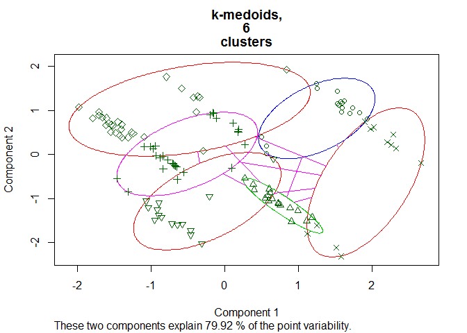

# CCC - Categorization, Clustering and Classification

The package implements the 3C-strategy for the refinement of disease
diagnoses in medical research.

The first step in the analysis pipeline is manual **C**ategorization of
the feature set to: (i) current clinical measures \[CM\] , (ii)
potential biomarkers \[PB\] and (iii) assigned diagnosis \[DX\] (one
variable).

In the beginning of the second step (**C**lustering), a subset of the
clinical measures is selected via supervised algorithm (Random Forest,
LASSO or else) with the assigned diagnosis as the target variable. Then,
the selected measures are used to determine the number of clusters for
the clustering. Next, the clustering algorithm is applied (K-means,
K-medoids or Hierarchical clustering).

In the third step, new model is trained using the potential biomarkers
as features, to **C**lassify the data according to the cluster labels
created in step 2.

## Installation

You can install CCC from github with:

``` r
# install.packages("devtools")
devtools::install_github("HBPMedical/CCC")
```

## Example

This is a basic example of the analysis pipeline:

``` r
library(CCC)

data(c3_sample1)
data(c3_sample1_categories)

head(c3_sample1) 
#>   real_DX_f assigned_DX_f      CM.1        CM.2       CM.3 CM.4 CM.5 CM.6
#> 1       1.1             1 28.566518  0.07369715  1.6263875   21    8   -1
#> 2       1.2             1 15.509559 25.53818777  9.2405993    0    4  -42
#> 3       2.0             2 25.377065 53.43256731 16.3969632   12   18    2
#> 4      23.0             2 29.498170 67.64628000 37.5035800    6   24    1
#> 5       1.1             1 -7.077776  6.75407415 -0.1781555   21    9   -1
#> 6      23.0             2 21.114320 25.09747000  8.8454300    5   25    1
#>   CM.7        CM.8      CM.9      CM.10      PB.1     PB.2     PB.3
#> 1    1 0.005936107 0.2609568  0.5025907 15.924158 8.915524 11.96162
#> 2   -1 1.134033791 1.1041469  0.4507048 16.035978 3.990375 19.97231
#> 3    0 1.621167224 1.9743571  0.6250640 16.018029 8.991349 11.98188
#> 4    0 0.880386900 3.0477580  1.1618280 15.918170 9.003855 12.03102
#> 5    1 0.435844067 0.7694562 -0.1730930  1.901443 9.088093 11.97223
#> 6    0 0.379480500 1.8357270  0.8387324 16.004580 9.029173 12.11511
#>        PB.4     PB.5 PB.6 PB.7 PB.8 PB.9 PB.10
#> 1  2.976062 2.064337   12    7   80    4    13
#> 2 10.010121 7.987250   14    6   72    6    15
#> 3  2.950809 1.966095   15    6   70    6    15
#> 4  2.961199 2.074998   14    7   79    4    13
#> 5  2.938243 1.997625   13    7   80    4    13
#> 6  2.983341 2.001479   15    7   80    4    13
table(c3_sample1_categories[,"varCategory"])
#> 
#> CM DX PB 
#> 10  1 10

x <- get_xy_from_DATA_C2(c3_sample1, c3_sample1_categories)$x
y <- get_xy_from_DATA_C2(c3_sample1, c3_sample1_categories)$y

C2_results <- C2(x, y, feature_selection_method="RF", num_clusters_method="Manhattan", clustering_method="Manhattan", plot.num.clus=TRUE, plot.clustering=TRUE, k=6)
```

<!-- -->

``` r

C2_results
#> [[1]]
#> [1] "CM.5" "CM.1" "CM.4"
#> 
#> [[2]]
#> [1] 6
#> 
#> [[3]]
#>   [1] 1 2 3 3 4 3 3 5 3 6 1 4 5 2 5 5 5 5 2 5 3 1 3 6 1 4 6 2 3 1 2 3 2 1 5
#>  [36] 5 5 3 3 2 5 3 3 5 5 5 6 2 5 1 2 5 2 4 6 6 4 4 5 2 5 1 3 1 3 5 2 5 6 5
#>  [71] 1 5 4 4 4 3 5 2 3 3 2 3 2 4 3 1 5 6 1 6 1 6 6 5 5 5 5 4 5 3 1 1 1 3 3
#> [106] 4 6 3 3 3 6 1 3 2 6 6 3 3 2 3

PBx <- get_PBx_from_DATA_C3(c3_sample1, c3_sample1_categories)
new_y <- C2_results[[3]]

C3_results <- C3(PBx = PBx, newy = new_y, feature_selection_method = "RF", classification_method="RF") 

table(new_y, C3_results[[2]])
#>      
#> new_y  1  2  3  4  5  6
#>     1  8  1  2  6  0  0
#>     2  0 10  4  0  3  0
#>     3  0  4 11  0 12  3
#>     4  8  4  0  0  0  0
#>     5  1  1 12  0 12  3
#>     6  0  0  5  0  2  8
```
